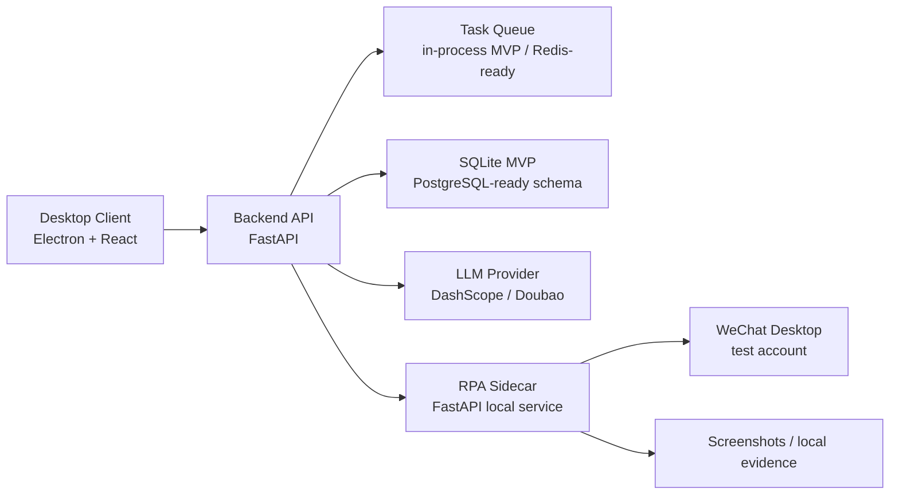
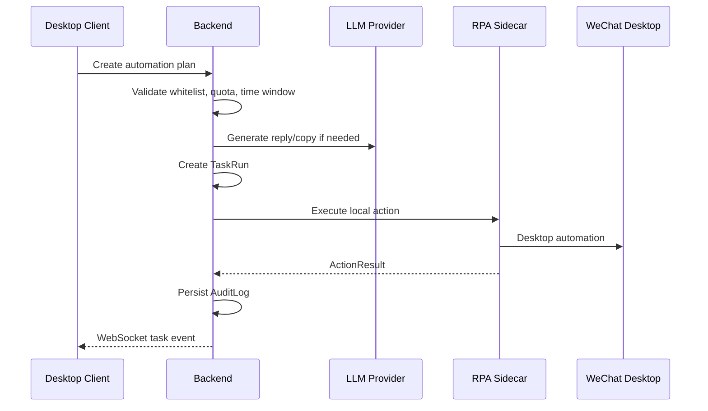
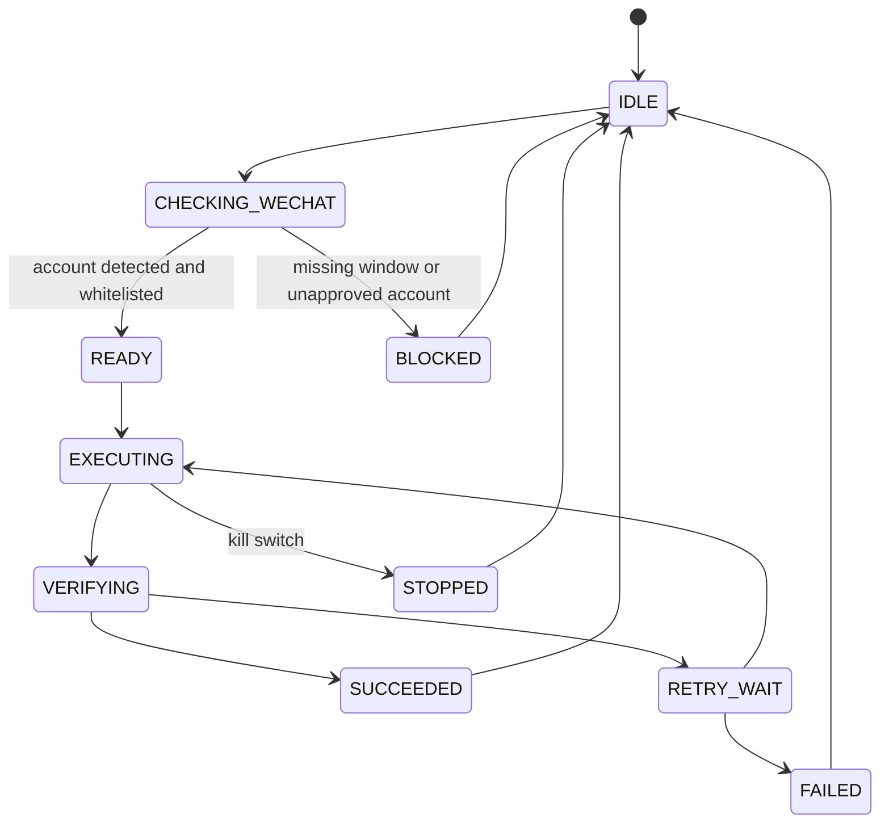

# Architecture

## Overview

Agent MVP has three cooperating services:

## Components

### Desktop Client

The client is an operator console, not a hidden automation implant. It shows account state, contacts, plans, task runs, and audit records. It talks only to the backend and never directly executes WeChat actions.

### Backend

The backend owns data and policy:

- plan creation and validation;
- whitelist and quota enforcement;
- LLM provider routing;
- task state transitions;
- audit log persistence;
- sidecar orchestration.

### RPA Sidecar

The sidecar owns local UI automation:

- process/window detection;
- dry-run simulation;
- guarded message, moment, like, and comment endpoints;
- evidence capture hooks;
- stop signal support.

## Task Flow

## RPA State Machine

## Guardrail Policy

Every outbound action must pass:

1. account whitelist;
2. contact whitelist or plan target whitelist;
3. quota check;
4. time-window check;
5. global kill switch check.

The sidecar also supports `dry_run=true` so the full backend flow can be verified without touching WeChat.
