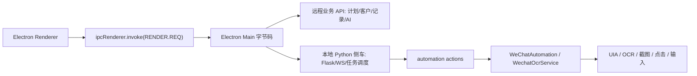

# 非屏幕发送通道研究报告

更新时间：2026-06-30

## 结论

当前没有验证通过的非屏幕发送通道，自动发送继续保持关闭。

现在已经稳定可用的价值链路是：静默同步微信好友、导入话术、生成千人千面触达预览、客户移除筛选、任务与审计记录。真实自动发送必须等到某个候选通道完成 1 个测试联系人 live gate，并返回可核验 receipt 后才开放。

## 阶段二新增产物

- 扫描脚本：`tools\research\dt_ai_helper_contract_scan.py`
- 脱敏扫描结果：`docs\research\dt-ai-helper-contract-scan.json`
- 扫描策略：只读取本地文件，不启动目标软件，不调用任何疑似发送接口，不保留凭证类内容。

## 本轮静态取证范围

- 目标目录：`C:\Users\28293\AppData\Local\Programs\dt-ai-helper`
- 主要文件：`resources\app.asar`、`resources\app.asar.unpacked\resources\main.exe`
- 只做本地静态分析；没有启动目标软件，没有调用疑似发送接口，没有复用对方线上服务、凭证、品牌素材或打包二进制作为生产依赖。

## 已观察到的线索

- 目标是 Electron 壳加本地 Python 侧车结构。
- `app.asar` 中包含 `out\main`、`out\preload`、`out\renderer` 和大量前端资源。
- `app.asar.unpacked\resources\config.json` 只暴露产品名、实例编号和主题色，没有可复用发送通道。
- Python 侧车包含 Flask、APScheduler、Playwright、Patchright、Selenium、OpenCV、PIL、sqlcipher3、websockets、win32 等依赖，说明它具备本地自动化和数据处理能力。
- `resources\_internal\scripts\wechat_ocr\wechat_icon` 下存在大量微信图标模板，例如搜索、朋友圈、发送按钮、语音、表情、内容区等。这更像屏幕视觉自动化资产，不符合当前“非屏幕发送”的生产方向。

## 阶段二合同画像

### Electron 前端合同

- 前端统一请求入口为 `window.electron.ipcRenderer.invoke(RENDER.REQ, { action, params, method })`。
- 线上业务基址在常量中出现：`prodServer`、`agentProdServer`、`prodMainHost`，对应远程业务服务。
- 前端 API 字典出现的微信相关业务接口包括：
  - 通讯录：`/we-chat/contact/pages`、`/we-chat/contact/add`、`/we-chat/contact/edit`、`/we-chat/contact/remove`、`/we-chat/contact/clear`
  - 群发计划：`/message_send_plan/pages`、`/message_send_plan/create`、`/message_send_plan/detail/list`、`/message_send_plan/pause`、`/message_send_plan/resume`
  - 聊天与 AI：`/chat/complete`、`/chat/polish`、`/chat/prompt/*`
  - 朋友圈营销：`/auto/we-chat-moment-campaigns/*`、`/auto/we_chat/post/*`、`/auto/we-chat-moment-comment-reply/*`
  - 私信：`/private_message/send_message`
  - RPA 配额上报：`/token/rpa/use/pre_check`、`/token/rpa/use/report`
- 这些接口更像“云端业务编排/配置/记录接口”，不是本地非屏幕发送口；复用它们也会依赖对方线上服务和账号体系，不符合当前 clean-room 目标。

### 本地 Python 候选

- 前端字典里的 `PYTHON.WECHAT` 只出现：
  - `/get_chat_history`
  - `/rpa_sync_chat_history`
  - `/get_chat_sessions`
- 这些接口偏向会话读取和聊天记录同步，没有发现直接本地消息发送 receipt 合同。
- Electron IPC 常量里出现 `PYTHON_SERVICE_MASS_SEND`、`PYTHON_SERVICE_START_GENERAL_RPA`、`PYTHON_SERVICE_BATCH_ADD_CONTACT`、`PYTHON_SERVICE_CHECK_WECHAT_PATH`，但参数和执行逻辑位于主进程字节码与 PyInstaller 包内；目前只能证明“存在任务调度入口”，不能证明“存在非屏幕发送通道”。

### PyInstaller 侧车模块

- `main.exe` 被解析为 PyInstaller CArchive，运行时为 `python312.dll`。
- PYZ 模块表共 2760 个模块，其中微信/自动化相关模块 89 个。
- 关键模块包括：
  - `scripts.automation.actions.MassSendWechatManagerV2`
  - `scripts.automation.actions.MomentMarketingManager`
  - `scripts.automation.actions.MomentPublishManager`
  - `scripts.automation.actions.MomentCommentReplyManager`
  - `scripts.wechat.WechatAutomation`
  - `scripts.wechat.ContactManager`
  - `scripts.http.wechat_api`
  - `scripts.ws.automation_control`
- 关键字符串证据：
  - 群发模块出现 `WechatOcrService`、`window_mode`、`send_multi_media_msgs_with_no_edit`
  - 朋友圈营销/发布/评论模块出现 `uiautomation`、`safe_click`、`screenshot_click_area`、`screenshot_wechat_area`
  - 微信自动化模块出现 `MoveWindow`、`Click`、`input_msg`、`get_wx_controls`
  - 联系人模块出现 `scroll_contact_action`、`SendKeys`、`Click`
- 这说明原执行层高度依赖 UIA、窗口、截图、OCR 和点击类动作；它不是当前要求的“完全非屏幕发送”路线。

## 阶段三：本地服务与任务状态合同

本轮增强扫描器后，已经能读取 Python 侧车的代码常量表。通俗讲，不是只看“文件名”，而是能看到它内部写死的一部分路由名、事件名、任务状态名。

- 已还原出本地任务上报接口语义：
  - `/api/client/task/poll`
  - `/api/client/task/ack`
  - `/api/client/task/heartbeat`
  - `/api/client/task/pause`
  - `/api/client/task/progress`
  - `/api/client/task/complete`
- 已观察到 WS/任务事件语义：
  - `task.dispatch`
  - `task.paused`
  - `client_id`
  - `message_type`
  - `progress`
  - `callback`
- 已观察到可复刻的任务治理思路：
  - 任务轮询、确认、心跳、进度、完成上报。
  - 全局暂停、云端任务抢占、本地任务暂停同步。
  - 失败数、待处理数、进度百分比、失败原因等任务字段。
- 仍然没有发现合格的非屏幕发送 receipt：
  - `MassSendWechatManagerV2` 仍出现 `WechatOcrService`、`input_msg`。
  - `WechatAutomation` 仍出现 `uiautomation`、`MoveWindow`、`Click`、`get_wx_controls`。
  - 朋友圈相关模块仍出现 `safe_click`、`screenshot_click_area`、`screenshot_wechat_area`。

结论：任务系统的“管理方式”可以 clean-room 复刻；真正执行微信动作的“发送方式”仍不符合非屏幕路线，不能开放自动发送。

## 数据流判断

当前能安全复刻的是 D 侧的业务编排模型和 E 侧的任务状态机。尤其是任务轮询、确认、心跳、进度、完成、暂停这些状态语义可以迁移到我们自己的后端；H 侧不符合非屏幕发送目标。

## 候选通道矩阵

| 候选通道 | 当前状态 | 是否能发送 | 是否可用于当前产品 | 依据 | 下一步 |
| --- | --- | --- | --- | --- | --- |
| `dt-ai-helper` 本地服务合同 | 研究中 | 否 | 暂不可用 | 已确认本地侧车含任务调度、WS 事件和自动化模块；任务状态语义可复刻，但关键执行证据仍指向 UIA/OCR/截图/点击，没有发现非屏幕 receipt | 复刻任务治理模型，继续保持 no-send 探针 |
| 微信本地数据 / IPC / 进程通道 | 未验证 | 否 | 暂不可用 | 目前本地库路线只证明能做通讯录同步；没有证明写库或进程通道可以安全触发消息发送 | 只研究可读账本、可验证回执来源，不写入微信数据库 |
| 参考项目 `-RPAagent` 安全边界 | 仅参考 | 否 | 可复用安全规则 | 可复用白名单、限额、审计、单人 live gate；不能复用屏幕点击发送路线 | 把安全门控保留在当前产品中，等待真实非屏幕通道 |

## 当前产品安全门

- `/send/driver/probe` 必须返回 `verified=false`。
- `/touch/plans/{id}/run` 在 `verified=false` 时不能绕过发送门。
- 前端“开始发送”按钮保持禁用，并显示通道研究进度。
- 点击发送不会点击微信、不会输入消息、不会移动窗口。

## live gate 开放条件

只有同时满足以下条件，才允许把 `verified` 改为 `true`：

1. 候选通道能对 1 个明确测试联系人发送带 `这是测试说明：` 前缀的消息。
2. 通道返回 receipt，至少包含通道编号、测试联系人标识、发送时间、结果标识。
3. 用户在微信里人工确认消息到达正确会话。
4. 后端记录任务、审计和 receipt，不保存任何敏感凭证。
5. 第一次成功后只开放 1 人发送；再次确认后再开放 3 人小批量。

## 如果找不到安全通道

产品不回退到坐标、OCR、UI 滚动或盲点点击。交付方向改为“客户触达执行包”：

- 批量生成每个客户的个性化话术。
- 提供复制、导出、执行清单和 15 天触达间隔管理。
- 保留客户筛选、计划、任务、审计和结果记录。
- 把自动发送明确标为“通道未验证，不执行”。
